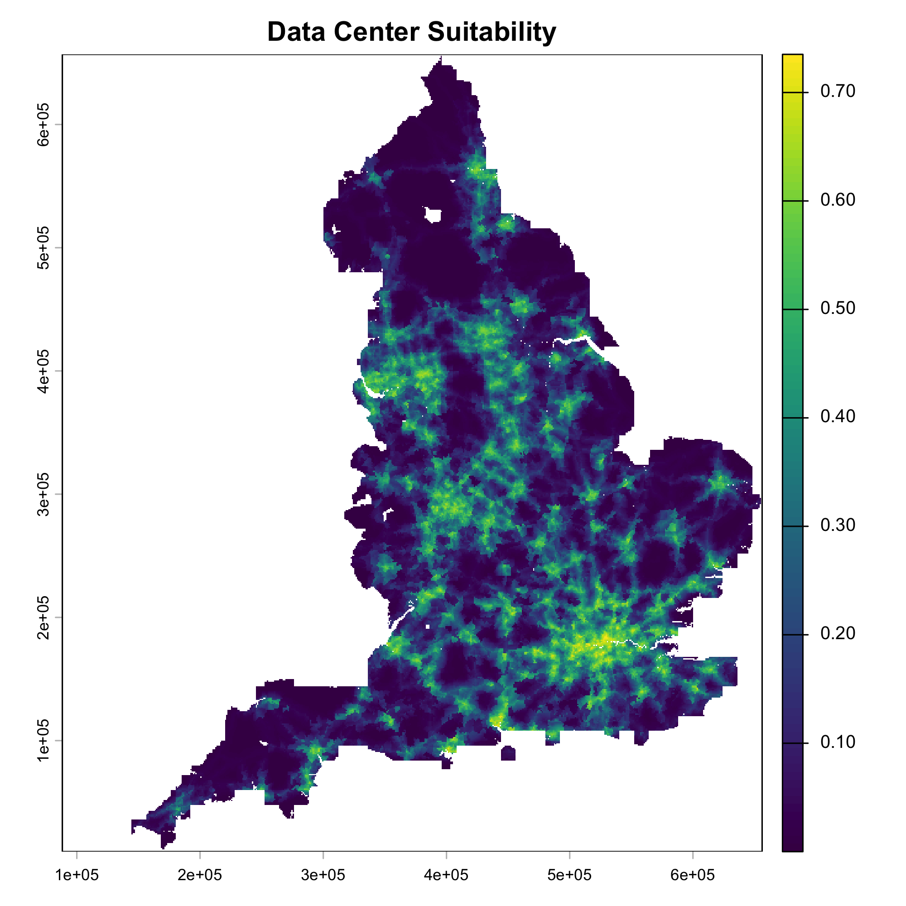
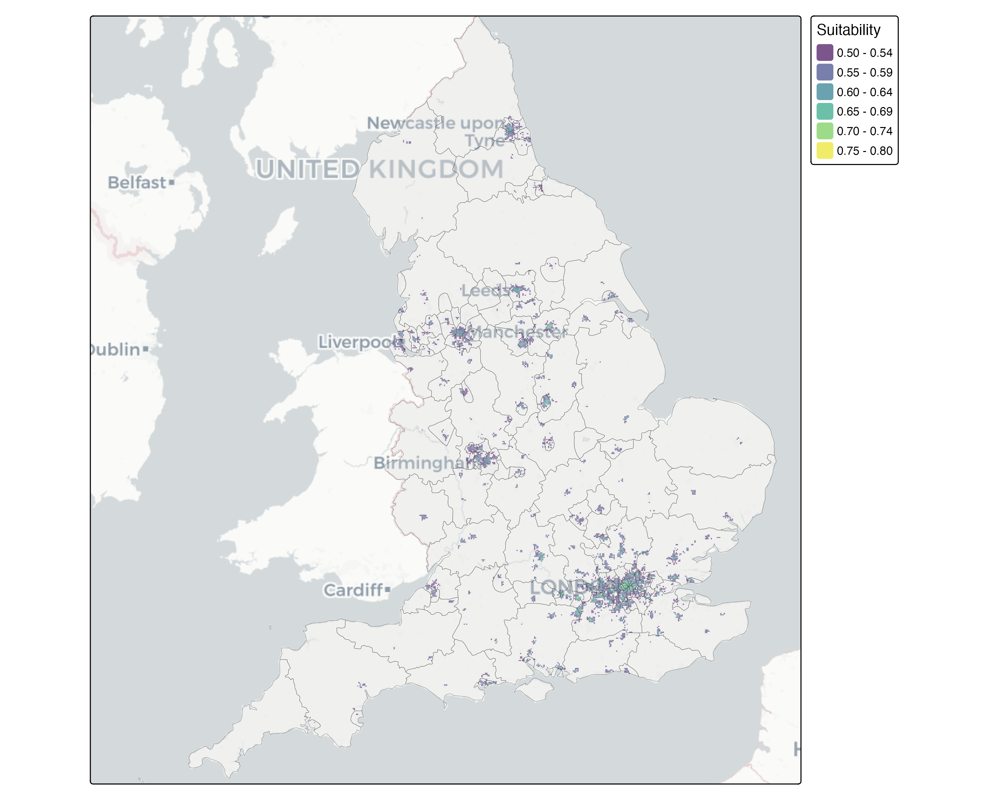

# Geocomputation Project

## Files
`WebCrawler`: Get data centres information from web pages, need google api for geocoding   
`RasterPreprocessNetwork`: Process suitibility raster from network data for MaxEnt model input   
`RasterPreprocessPoint`: Process suitibility raster from point data for MaxEnt model input   
`MaxEnt`: Run MaxEnt model for suitibility map, need prepared raster data and data centres

## Datasource
1. Annual Average Air Temperature: [Climate Data Portal](https://climate-themetoffice.hub.arcgis.com/datasets/TheMetOffice::annual-average-temperature-change-projections-local-authority-v1/about)
2. Wind Speed: [Climate Data Portal](https://climate-themetoffice.hub.arcgis.com/datasets/6b2bee0ed29749caaaf9c49f5ddd3a7f_0/explore?location=58.145712%2C-5.068438%2C7.53)
3. Drought: [Climate Data Portal](https://climate-themetoffice.hub.arcgis.com/datasets/b9e6f84d2ee943d0be17d93366bca8dc_0/explore?location=54.832243%2C-3.273213%2C6.19)
4. Water availability: [Data Services Platform](https://environment.data.gov.uk/dataset/62514eb5-e9d5-4d96-8b73-a40c5b702d43)
5. Brownfield Site: [Brownfield site](https://www.planning.data.gov.uk/dataset/brownfield-land)
6. Major and Strategic Road Networks: [Edina Digimap Platform - paid or academic access required](https://digimap.edina.ac.uk/)
7. Journey Times to Employment Centres - jts0501.ods: [Gov.UK Statistical data set](https://www.gov.uk/government/statistical-data-sets/journey-time-statistics-data-tables-jts)
8. Solar irradiation: https://globalsolaratlas.info/map?s=52.531021,-1.264906&m=site&c=52.531021,-1.264906,11
9. Geology: https://www.bgs.ac.uk/datasets/bgs-geology-625k/
10. Flood risk zones: https://environment.data.gov.uk/dataset/f3d63ec5-a21a-49fb-803a-0fa0fb7238b6

## Suitability Map
| Suitability Map | Suitability > 0.5 |
| :---: | :---: |
|  |  |
